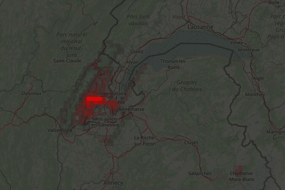

# derive.rs

Rust reimplementation of [derive](https://github.com/erik/derive). Takes a Strava data
export and renders heatmaps based on activities.

## Example usage

### Static Heatmap

The command
```
cargo run --release -- \
    --lat=46.25 --lon=6.1 --zoom=11 \
    --width=600 --height=400 \
    --tint=0.6 \
    --heatmap=squadratino \
    --output=heatmap.jpg \
    ~/Downloads/strava
```
gives me this heatmap:


### Animated Heatmap

Using the `--stream` argument and `--frame-rate` to control after how many tile updates
new frames are produced
```
cargo run --release -- \
    --lat=46.25 --lon=6.3 --zoom=9 \
    --width=600 --height=400 \
    --tint 0.7 \
    --heatmap=squadrat \
    --stream --frame-rate 1250 \
    ~/Downloads/strava \
    | ffmpeg -i - -y heatmap.gif
```
and produces an animation:


